# Object Detection — Blood Cell Detection (BCCD)

Fine-tune [DETR](https://huggingface.co/docs/transformers/en/model_doc/detr) (DEtection TRansformer) and other Hugging Face object detection models on the **BCCD (Blood Cell Count and Detection)** dataset. The task is to detect and classify three types of blood cells: **RBC** (Red Blood Cells), **WBC** (White Blood Cells), and **Platelets**.

## Dataset

The [BCCD Dataset](https://github.com/Shenggan/BCCD_Dataset) contains microscopic blood cell images with Pascal VOC‑format XML annotations. A conversion script (`src/convert_to_coco.py`) transforms the annotations into COCO JSON format, which is then consumed by the PyTorch `Dataset` and Hugging Face `Trainer`.

| Split       | Images |
|-------------|--------|
| train       | 162    |
| trainval    | 205    |
| val         | 43     |
| test        | 72     |

Class mapping (0‑indexed):

| ID | Label     |
|----|-----------|
| 0  | RBC       |
| 1  | WBC       |
| 2  | Platelets |

## Project Structure

```
.
├── main.py                    # Placeholder entry point
├── pyproject.toml             # Dependencies (uv/pip)
├── .pre-commit-config.yaml    # Linting & formatting hooks
├── README.md
├── data/
│   └── BCCD/
│       ├── JPEGImages/        # Blood cell images (.jpg)
│       ├── Annotations/       # Pascal VOC XML annotations
│       ├── ImageSets/Main/    # Train/val/test split files (.txt)
│       └── coco/              # Converted COCO JSON annotations
├── src/
│   ├── __init__.py
│   ├── constants.py           # Dataset directory paths
│   ├── convert_to_coco.py     # VOC → COCO conversion
│   ├── dataset.py             # PyTorch Dataset wrapping COCO
│   ├── train.py               # Training script (HF Trainer)
│   └── evaluate.py            # Evaluation + FiftyOne visualization
└── results/
    ├── 50ep/                  # Evaluation artifacts for 50-epoch model
    │   ├── confusion_matrix.png
    │   ├── confusion_matrix.html
    │   ├── pr_curves.png
    │   ├── pr_curves.html
    │   └── metrics.json
    ├── 100ep/                 # Evaluation artifacts for 100-epoch model
    │   ├── confusion_matrix.png
    │   ├── confusion_matrix.html
    │   ├── pr_curves.png
    │   ├── pr_curves.html
    │   └── metrics.json
    └── val_samples/           # Sample validation images
        ├── BloodImage_00000.jpg
        ├── BloodImage_00002.jpg
        ......
```

## Setup

This project uses [uv](https://github.com/astral-sh/uv) for package management. Alternatively, `pip` can be used directly.

### Using uv

```bash
uv sync
```

### Using pip

```bash
pip install -e .
```

### Pre-commit hooks (optional but recommended)

```bash
uv run pre-commit install
```

## Usage

### 1. Convert Annotations

Convert the Pascal VOC XML files in `data/BCCD/Annotations/` to COCO JSON format:

```bash
uv run python src/convert_to_coco.py
```

> **Note:** This step has already been performed and the COCO JSON files are already committed to the repository.

This creates `train.json`, `val.json`, `trainval.json`, and `test.json` inside `data/BCCD/coco/`.

### 2. Train

Train a DETR model (or any compatible Hugging Face object detection model) on the BCCD dataset:

```bash
uv run python src/train.py \
    --model-name facebook/detr-resnet-50 \
    --epochs 50 \
    --batch-size 8
```

**Arguments:**

| Argument        | Default | Description                             |
|-----------------|---------|-----------------------------------------|
| `--model-name`  | —       | HF model ID (e.g. `facebook/detr-resnet-50`, `PekingU/rtdetr_r50vd`, `microsoft/conditional-detr-resnet-50`) |
| `--epochs`      | 50      | Number of training epochs               |
| `--batch-size`  | 8       | Per‑device batch size                   |

Checkpoints and logs are saved to `.output/{model_id}_{epochs}ep_{batch_size}bs_{lr}lr/`.

### 3. Evaluate

Run inference on the validation set and compute metrics:

```bash
uv run python src/evaluate.py --model-dir .output/detr-resnet-50_50ep_8bs_1e-05lr
```

This script will:

- Run inference with a score threshold of 0.5
- Compute **mean Average Precision (mAP)** metrics using `torchmetrics.detection.MeanAveragePrecision` (overall and per‑class)
- Save numeric metrics to `{model_dir}/eval/metrics.json`
- Launch a **FiftyOne** visualization app to explore predictions interactively
- Generate **confusion matrix** and **precision‑recall curves** in two formats:
  - Interactive HTML (Plotly) — viewable in any web browser
  - Static PNG (matplotlib) — suitable for quick reference

**Arguments:**

| Argument       | Default                      | Description                     |
|----------------|------------------------------|---------------------------------|
| `--model-dir`  | —                            | Path to trained model directory |
| `--val-ann`    | `data/BCCD/coco/val.json`    | Validation COCO annotation file |

## Results

Trained on the **train** set; metrics reported on the **validation** set.

### DETR ResNet-50 — 50 epochs

| Metric          | Value   |
|-----------------|---------|
| mAP             | 0.4512  |
| mAP @ IoU=0.50  | 0.5970  |
| mAP @ IoU=0.75  | 0.5381  |
| mAP (small)     | 0.0000  |
| mAP (medium)    | 0.2378  |
| mAP (large)     | 0.6813  |
| mAR @ 1         | 0.3003  |
| mAR @ 10        | 0.4545  |
| mAR @ 100       | 0.5192  |
| mAP RBC         | 0.5343  |
| mAP WBC         | 0.8016  |
| mAP Platelets   | 0.0178  |

#### Confusion Matrix

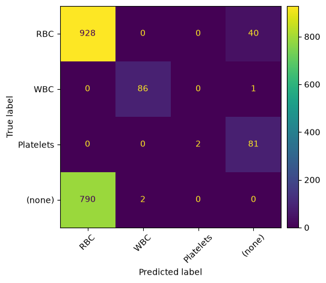

#### Precision-Recall Curves

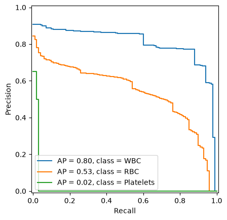

---

### DETR ResNet-50 — 100 epochs

| Metric          | Value   |
|-----------------|---------|
| mAP             | 0.5392  |
| mAP @ IoU=0.50  | 0.7980  |
| mAP @ IoU=0.75  | 0.6076  |
| mAP (small)     | 0.1278  |
| mAP (medium)    | 0.3823  |
| mAP (large)     | 0.6802  |
| mAR @ 1         | 0.3793  |
| mAR @ 10        | 0.6293  |
| mAR @ 100       | 0.6826  |
| mAP RBC         | 0.5487  |
| mAP WBC         | 0.7799  |
| mAP Platelets   | 0.2891  |

#### Confusion Matrix

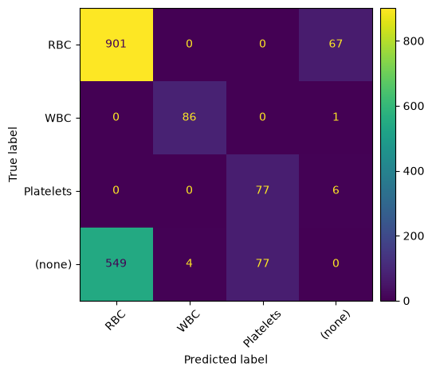

#### Precision-Recall Curves

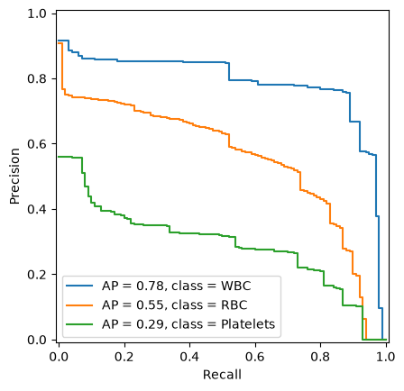

---

### Validation Sample Images (Ground Truth vs Predictions)

Each image shows the **ground truth** (left) and **model predictions** (right) side by side by fine-tuned DETR model with 100 epochs. 
Bounding box colors: **Green** = RBC, **Red** = WBC, **Blue** = Platelets.

| Image | Ground Truth → Predictions |
|-------|---------------------------|
| BloodImage_00000 | 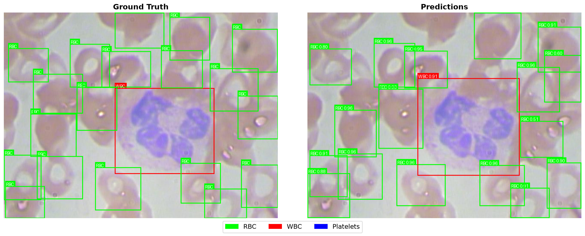 |
| BloodImage_00002 | 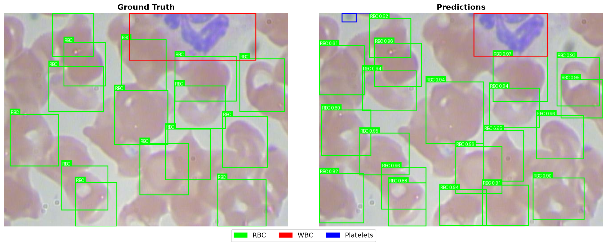 |
| BloodImage_00014 | 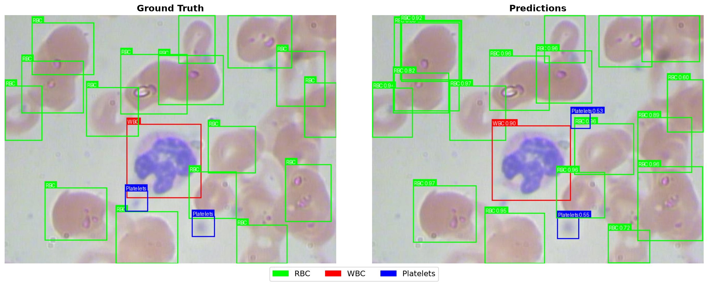 |
| BloodImage_00017 | 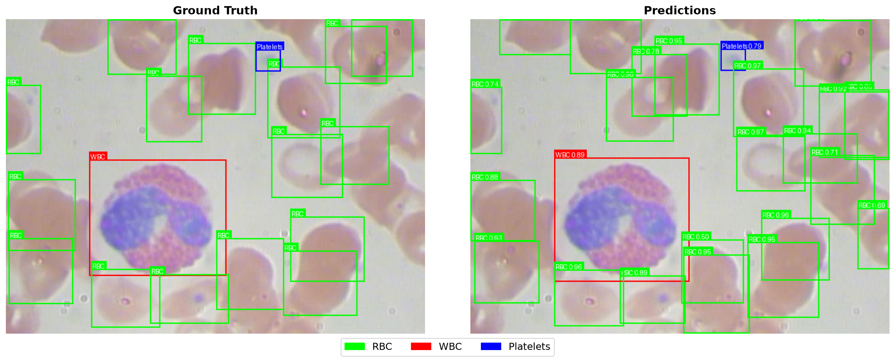 |
| BloodImage_00028 | 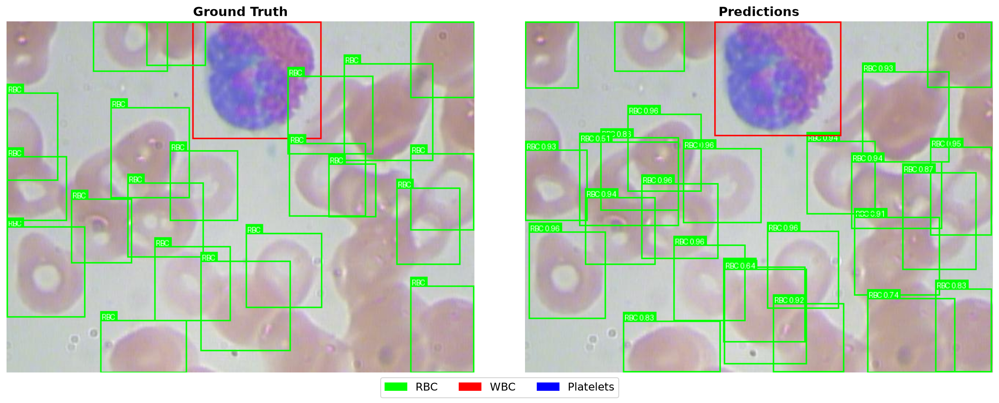 |
| BloodImage_00029 | 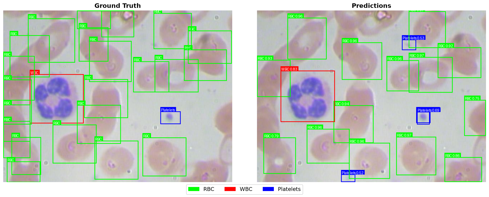 |
| BloodImage_00030 | 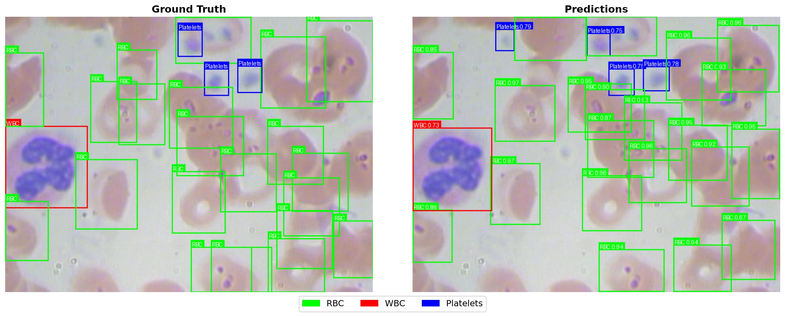 |
| BloodImage_00035 | 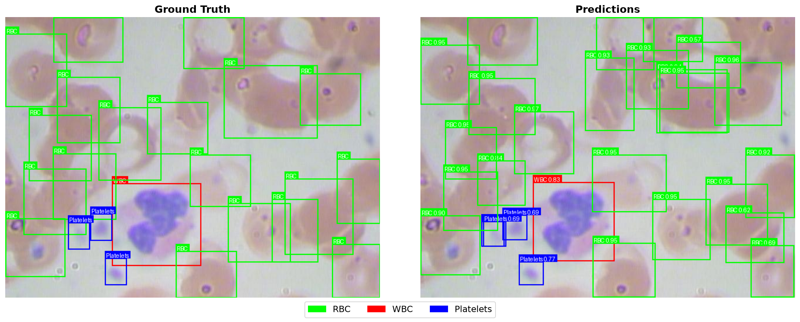 |
| BloodImage_00037 | 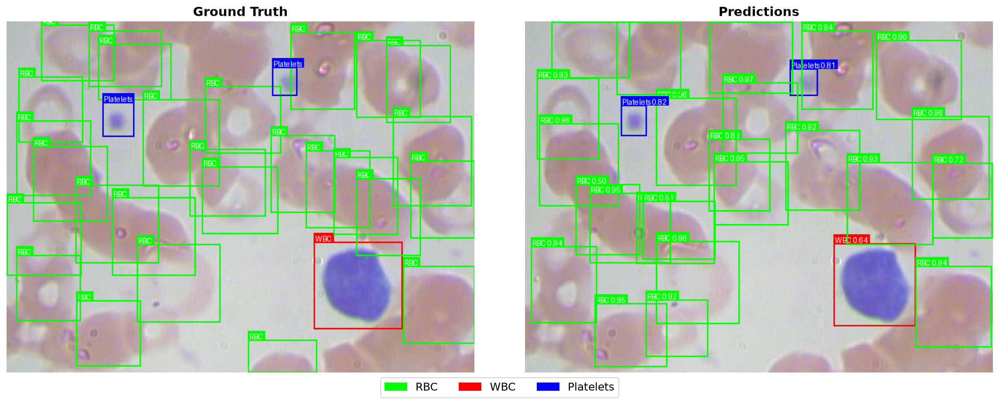 |
| BloodImage_00053 | 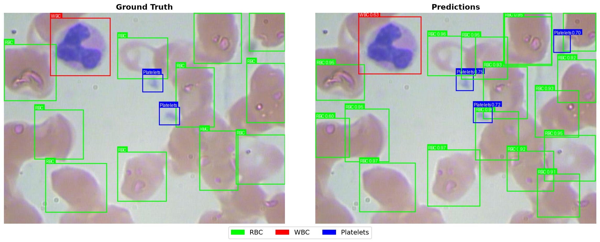 |
